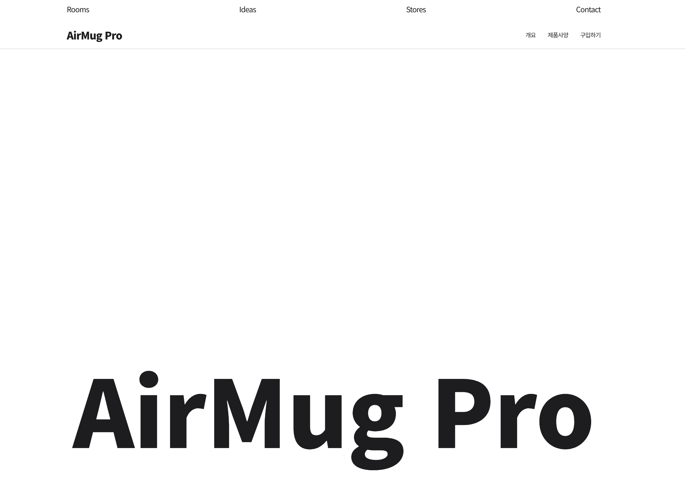

Scroll - Javascript
===

위 Repositories의 목적
---
  기본적으로 scroll에 따른 웹사이트의 동적인 변화에 대한 공부를 위함입니다.
  대표적인 예로 Apple 사이트와 같은 이미지의 동적인 변화를 주로 다룹니다.

2020-09-27 // 진행 내용
---
  사이트에 들어갈 사진을 제외한 내용을 작성하였으며, 그에 따른 css 밑작업까지 진행되었습니다.
  메뉴 관련 스타일링과 인터랙션 구현을 위한 컨셉을 잡았으며, Scroll에 따른 이미지 변화를 위해
  기본 처리 개념, 스크롤(각 영역별) 높이 세팅, 활성시킬 화면(씬)을 결정하는 코드까지 작성되었습니다.

2020-09-27 // 확인 사항
---
  

  ``` javascript
  .global-nav {
  position: absolute;
      top: 0;
      left: 0;
  }    
  ```
  
  위 코드는 현재 global-nav 즉 최상단 메뉴의 css 내용 일부입니다.
  높이를 0으로 맞춰 하기에 보이는 기능을 실행할때
  이 메뉴의 높이까지 합산해서 scroll 영역을 포함하지 않도록 하기위함입니다.
  
  ``` javascript
      function setLayout() {
        // 각 스크롤 섹션의 높이 세팅
        for (let i = 0; i < sceneInfo.length; i++) {
            sceneInfo[i].scrollHeight = sceneInfo[i].heightNum * window.innerHeight; /* window(전역객체)는 따로 작성하지 않아도 됨 */
            sceneInfo[i].objs.container.style.height = `${sceneInfo[i].scrollHeight}px`; /* 숨겨진 영역에 대한 높이 설정 템플릿 기호를 사용(괄호 안에는 변수명을 기입 가능) */
        }
    }

    function scrollLoop() {
        prevScrollHeight = 0;
        for (let i = 0; i < currentScene; i++) {
            prevScrollHeight += sceneInfo[i].scrollHeight;
        }

        if (yOffset > prevScrollHeight + sceneInfo[currentScene].scrollHeight) {
            currentScene++;
        }
        if (yOffset < prevScrollHeight) {
            if (currentScene === 0) return; // 브라우저 최상단에서 더 올릴시 바운스 효과가 생기는데 이때 currentScene이 마이너스 되는 것을 방지(모바일)
            currentScene--;
        }

        document.body.setAttribute('id', `show-scene-${currentScene}`);
    }

    window.addEventListener('scroll', () => {
        yOffset = window.pageYOffset; // page의 scroll 값을 체크하는 메서드
        scrollLoop();
    });
  ```
위 코드 위쪽으로는 객체로 이루어진 변수가 존재합니다. 해당 객체 내용을 참조하여 작성이 되었으며,
코드 내의 자주 사용하지 않거나 주의사항 같은 내용들이 적혀있으니, 확인하시면 됩니다.
작성되지 않는 변수 및 위 코드들은 전부 즉시실행 함수로 감싸져 있으며,
이는 전역 변수를 최대한 사용을 안하고자 하는 취지에서 작업하였습니다.(전역 변수는 되도록 충돌 및 각종 js 파일에서 가져갈수있는 위험부담이 있어서 그렇습니다.)

